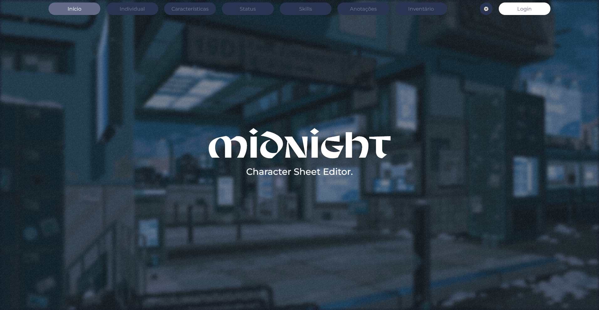

# The Mental World Character Sheet Editor

> Uma plataforma de criação, importação e exportação de fichas de RPG em formato JSON.

### Ajustes e melhorias

O projeto ainda está em desenvolvimento e as próximas atualizações serão voltadas nas seguintes tarefas:

- [X] Adicionar seção de artes arcanas na página de _status_
- [X] Adicionar seção de subartes arcanas na página de _status_
- [ ] Adicionar página de energia
- [X] Adicionar barra de navegação
- [ ] Adicionar página de _skills_
- [ ] Adicionar página de inventário
- [ ] Adicionar página de pets
- [X] Adicionar página de anotações